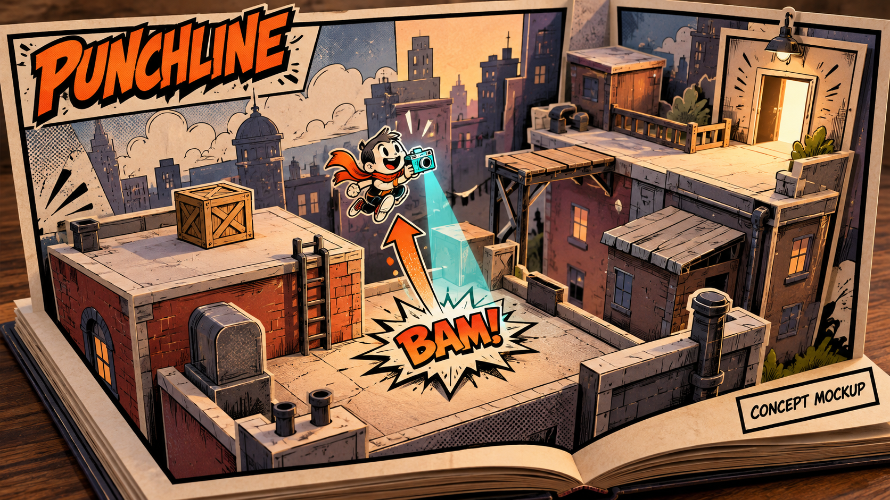

# PUNCHLINE

**Twist the words. Light the page. Change the ending.**

A proposed **3D pop-up comic puzzle platformer** for a 100-hour game jam combining **Comic, Twist and Light**. Comic panels unfold into small playable city dioramas. You play Snap, a background character with a flash camera. Rotate printed **BAM!** signs, then illuminate them to launch yourself or shove props through the 3D set. The finale turns the villain's own punch into your escape.

## Current status

This repository currently contains pre-jam design and proposal documents. Game code, mechanics and core architecture will be created during the official development window.

- [Two-page proposal](proposal.pdf) - **draft**, with four teammate records, team name and track still pending.
- [Editable proposal text](proposal.md).
- [Production plan](PRODUCTION_PLAN.md), including the proposed rules, eight challenges and 100-hour milestones.
- **itch.io browser build:** not yet available. The public playable link will be added here before final submission.

## Planned game

Eight compact 3D challenges across three comic pages, targeting a 10-15 minute first playthrough. Authored cameras frame each room for readable depth, aiming and landings. One shared interaction combines the themes: comic sound effects are physical objects, quarter-turn rotation changes their force direction, and light activates them. Planned support includes checkpoints, instant panel reset, pause, sound controls and reduced flash/shake settings.

## Art direction

This is an **AI-generated concept mockup**, not an implemented gameplay screenshot. It sets a target for folded-paper scenery, black ink contours, orange force graphics and cyan camera light. During development, the team will make reusable stylized models and prioritize game readability over decorative detail. The [generation prompt](docs/concepts/punchline-3d-concept-prompt.md) and disclosure are included.

## Setup and run

The working engine choice is Godot 4 with GDScript, Compatibility rendering and a single-threaded web export. No runnable Godot project exists yet. Exact engine version, setup steps and run instructions will be added with the first playable build.

You can read the proposal and planning documents directly on GitHub or download this repository now.

## Planned controls

| Action | Input |
| --- | --- |
| Move across the 3D room | WASD or arrow keys |
| Aim at a sound word | Mouse |
| Rotate the selected word | Q/E |
| Camera flash | Left click or Space |
| Reset the current panel | R |
| Pause | Escape |

Final bindings will be checked in playtests.

## Team

Team name and track are pending confirmation.

| Name | Email | IndieConnect ID |
| --- | --- | --- |
| Varun Patil | varun.patil@students.iiit.ac.in | @varunp685 |
| Teammate 2 - pending | pending | pending |
| Teammate 3 - pending | pending | pending |
| Teammate 4 - pending | pending | pending |
| Teammate 5 - pending | pending | pending |

## Assets and AI disclosure

See [CREDITS.md](CREDITS.md) for asset attribution and tool disclosures. No third-party game assets have been added. Codex/ChatGPT assisted concept exploration, design review, proposal drafting, PDF preparation and repository documentation. OpenAI ImageGen produced the pre-jam art-direction mockup. The team owns creative direction and final decisions. Further AI use and every external asset will be recorded as development proceeds.

## License

Repository code and original documentation are covered by the [MIT License](LICENSE). Any future third-party assets retain their own licenses, which will be listed in CREDITS.md.
